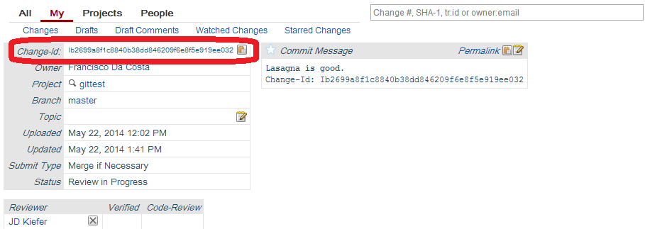

Gerrit Reviews
==============

SSH Keys
--------
Before you begin, make sure your SSH keys match your email address on teamforge:
```bash
ssh-keygen -t rsa -C "your_email@example.com"
```

Coding
------
* write your code changes and commit locally.
* push your changes to review using:
```bash
git push origin HEAD:refs/for/master
```
This will push it to the gerrit staging area, the place where the automated
tests and code reviews will happen.

Review Phase
------------

Reviewers can set the  'verified' status:

| value | meaning  | 
|-------|----------|
| +1    | Verified |
| 0     | No Score |
| -1    | Fails    |

Reviewers can set 'code review' status: 

| value | meaning                   | comment                                       |
|-------|---------------------------| ----------------------------------------------|
| +2    | Approved                  | The only way to merge the code when we submit |
| +1    | Looks good, can't approve | Vote                                          |
| 0     | No Score                  | absence                                       | 
| -1    | Prefer you didn't submit  | negative vote                                 | 
| -2    | Do not submit this        | strong negative vote                          | 

You can actually grab the changes using the "fetch" command in the "Download"
attribute on the gerrit commit description.

Squashing commits
----------------

In the git workflow, it's common to do several commits in a local branch before
pushing the changes to the remote server. This is a good practice while
developing, because it allows small incremental changes. 

On the other hand, when commits are posted to review, we may see many commits
with partial or broken functionality. This adds overhead to the review process,
and reduces its efficiency.

To minimize the number of reviews, try to squash commits that have related
changes. You can do it with the squash command, selecting the <HASH> of your
first commit: 

```bash
# N is the number of commits you want to 
git rebase -i HEAD~<N>
```

Git will show you a list of commits that can be picked, edited or squashed. Try
to pick one commit and squash other commits that have related changes. This
will make life easier for all the reviewers that will look at your code.


Approved Commits
----------------

=== Without Conflicts
A commit must receive a +2 from a reviewer and the reviewer must submit the
commit. Once this is done, the commit gets merged.

=== With Conflicts
if you get a conflict when submiting a review, you have to rebase your commit with
```bash
git checkout <HASH>
git pull --rebase 
```
Then fix all conflicts, one by one. Edit the file to solve the conflict, then
git add git rebase --continue to go to the next conflict until you solve them
all. Then you just Rework your commit. 

Reworking Commits
-----------------
If you get feedback and want to rework your code:

Rebase your working copy applying your commit to the top of the HEAD. You
can find your change ID from your git log or get it from gerrit in the
"Change-Id" attribute. 



Then run it like:
```bash
git rebase <HASH>
```

Edit your changes and amend your commit locally with 
```bash
git add .
git commit --amend
```
This will cause a new patch set and send an email message to the reviewers.
Don't forget to add the change ID for your code review, so you will submit a
patch, and not a new review.

